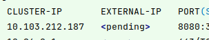
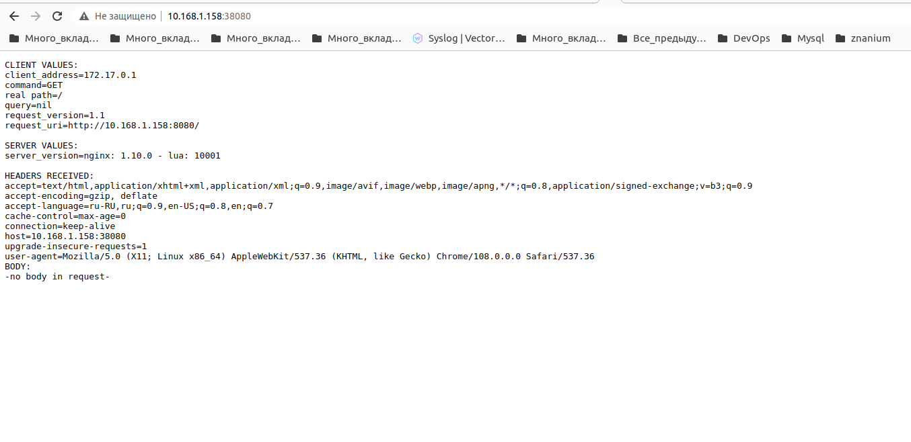

# Домашнее задание к занятию "12.1 Компоненты Kubernetes"

Вы DevOps инженер в крупной компании с большим парком сервисов. Ваша задача — разворачивать эти продукты в корпоративном кластере. 

## Задача 1: Установить Minikube

Для экспериментов и валидации ваших решений вам нужно подготовить тестовую среду для работы с Kubernetes. Оптимальное решение — развернуть на рабочей машине Minikube.

### Как поставить на AWS:
- создать EC2 виртуальную машину (Ubuntu Server 20.04 LTS (HVM), SSD Volume Type) с типом **t3.small**. Для работы потребуется настроить Security Group для доступа по ssh. Не забудьте указать keypair, он потребуется для подключения.
- подключитесь к серверу по ssh (ssh ubuntu@<ipv4_public_ip> -i <keypair>.pem)
- установите миникуб и докер следующими командами:
  - curl -LO https://storage.googleapis.com/kubernetes-release/release/`curl -s https://storage.googleapis.com/kubernetes-release/release/stable.txt`/bin/linux/amd64/kubectl
  - chmod +x ./kubectl
  - sudo mv ./kubectl /usr/local/bin/kubectl
  - sudo apt-get update && sudo apt-get install docker.io conntrack -y
  - curl -Lo minikube https://storage.googleapis.com/minikube/releases/latest/minikube-linux-amd64 && chmod +x minikube && sudo mv minikube /usr/local/bin/
- проверить версию можно командой minikube version
- переключаемся на root и запускаем миникуб: minikube start --vm-driver=none
- после запуска стоит проверить статус: minikube status
- запущенные служебные компоненты можно увидеть командой: kubectl get pods --namespace=kube-system

### Для сброса кластера стоит удалить кластер и создать заново:
- minikube delete
- minikube start --vm-driver=none

Возможно, для повторного запуска потребуется выполнить команду: sudo sysctl fs.protected_regular=0

Инструкция по установке Minikube - [ссылка](https://kubernetes.io/ru/docs/tasks/tools/install-minikube/)

**Важно**: t3.small не входит во free tier, следите за бюджетом аккаунта и удаляйте виртуалку.

## Задача 2: Запуск Hello World
После установки Minikube требуется его проверить. Для этого подойдет стандартное приложение hello world. А для доступа к нему потребуется ingress.

- развернуть через Minikube тестовое приложение по [туториалу](https://kubernetes.io/ru/docs/tutorials/hello-minikube/#%D1%81%D0%BE%D0%B7%D0%B4%D0%B0%D0%BD%D0%B8%D0%B5-%D0%BA%D0%BB%D0%B0%D1%81%D1%82%D0%B5%D1%80%D0%B0-minikube)
- установить аддоны ingress и dashboard

## Задача 3: Установить kubectl

Подготовить рабочую машину для управления корпоративным кластером. Установить клиентское приложение kubectl.
- подключиться к minikube 
- проверить работу приложения из задания 2, запустив port-forward до кластера

## Задача 4 (*): собрать через ansible (необязательное)

Профессионалы не делают одну и ту же задачу два раза. Давайте закрепим полученные навыки, автоматизировав выполнение заданий  ansible-скриптами. При выполнении задания обратите внимание на доступные модули для k8s под ansible.
 - собрать роль для установки minikube на aws сервисе (с установкой ingress)
 - собрать роль для запуска в кластере hello world
  

# Ответ:

## Задача 1: Установить Minikube

```shell
dmitriy@pegasix:~$ minikube start --vm-driver=kvm2
😄  minikube v1.28.0 on Ubuntu 20.04
✨  Using the kvm2 driver based on user configuration
👍  Starting control plane node minikube in cluster minikube
🔥  Creating kvm2 VM (CPUs=2, Memory=2200MB, Disk=20000MB) ...
🐳  Preparing Kubernetes v1.25.3 on Docker 20.10.20 ...
    ▪ Generating certificates and keys ...
    ▪ Booting up control plane ...
    ▪ Configuring RBAC rules ...
🔎  Verifying Kubernetes components...
    ▪ Using image gcr.io/k8s-minikube/storage-provisioner:v5
🌟  Enabled addons: storage-provisioner, default-storageclass
🏄  Done! kubectl is now configured to use "minikube" cluster and "default" namespace by default

dmitriy@pegasix:~$ kubectl cluster-info
Kubernetes control plane is running at https://192.168.39.40:8443
CoreDNS is running at https://192.168.39.40:8443/api/v1/namespaces/kube-system/services/kube-dns:dns/proxy

To further debug and diagnose cluster problems, use 'kubectl cluster-info dump'.
```


## Задача 2: Запуск Hello World

```shell
dmitriy@pegasix:~$ kubectl create deployment hello-node --image=k8s.gcr.io/echoserver:1.4
deployment.apps/hello-node created
```

```shell
dmitriy@pegasix:~$ kubectl get deployments
NAME         READY   UP-TO-DATE   AVAILABLE   AGE
hello-node   0/1     1            0           10s
```

```shell
dmitriy@pegasix:~$ kubectl get pods
NAME                         READY   STATUS    RESTARTS   AGE
hello-node-697897c86-84rvt   1/1     Running   0          17s
dmitriy@pegasix:~$ kubectl get events
LAST SEEN   TYPE     REASON                    OBJECT                            MESSAGE
28s         Normal   Scheduled                 pod/hello-node-697897c86-84rvt    Successfully assigned default/hello-node-697897c86-84rvt to minikube
28s         Normal   Pulling                   pod/hello-node-697897c86-84rvt    Pulling image "k8s.gcr.io/echoserver:1.4"
13s         Normal   Pulled                    pod/hello-node-697897c86-84rvt    Successfully pulled image "k8s.gcr.io/echoserver:1.4" in 14.29565649s
13s         Normal   Created                   pod/hello-node-697897c86-84rvt    Created container echoserver
13s         Normal   Started                   pod/hello-node-697897c86-84rvt    Started container echoserver
28s         Normal   SuccessfulCreate          replicaset/hello-node-697897c86   Created pod: hello-node-697897c86-84rvt
28s         Normal   ScalingReplicaSet         deployment/hello-node             Scaled up replica set hello-node-697897c86 to 1
41m         Normal   Starting                  node/minikube                     Starting kubelet.
41m         Normal   NodeHasSufficientMemory   node/minikube                     Node minikube status is now: NodeHasSufficientMemory
41m         Normal   NodeHasNoDiskPressure     node/minikube                     Node minikube status is now: NodeHasNoDiskPressure
41m         Normal   NodeHasSufficientPID      node/minikube                     Node minikube status is now: NodeHasSufficientPID
41m         Normal   NodeAllocatableEnforced   node/minikube                     Updated Node Allocatable limit across pods
41m         Normal   Starting                  node/minikube                     Starting kubelet.
41m         Normal   NodeAllocatableEnforced   node/minikube                     Updated Node Allocatable limit across pods
41m         Normal   NodeHasSufficientMemory   node/minikube                     Node minikube status is now: NodeHasSufficientMemory
41m         Normal   NodeHasNoDiskPressure     node/minikube                     Node minikube status is now: NodeHasNoDiskPressure
41m         Normal   NodeHasSufficientPID      node/minikube                     Node minikube status is now: NodeHasSufficientPID
41m         Normal   NodeReady                 node/minikube                     Node minikube status is now: NodeReady
40m         Normal   RegisteredNode            node/minikube                     Node minikube event: Registered Node minikube in Controller
40m         Normal   Starting                  node/minikube
```

```shell
dmitriy@pegasix:~$ kubectl config view
apiVersion: v1
clusters:
- cluster:
    certificate-authority: /home/dmitriy/.minikube/ca.crt
    extensions:
    - extension:   
        last-update: Tue, 27 Dec 2022 20:41:25 MSK
        provider: minikube.sigs.k8s.io
        version: v1.28.0
      name: cluster_info
    server: https://192.168.39.40:8443
  name: minikube   
contexts:
- context:
    cluster: minikube
    extensions:
    - extension:   
        last-update: Tue, 27 Dec 2022 20:41:25 MSK
        provider: minikube.sigs.k8s.io
        version: v1.28.0
      name: context_info
    namespace: default
    user: minikube 
  name: minikube   
current-context: minikube
kind: Config
preferences: {}
users:
- name: minikube   
  user:
    client-certificate: /home/dmitriy/.minikube/profiles/minikube/client.crt
    client-key: /home/dmitriy/.minikube/profiles/minikube/client.key
```

```shell
dmitriy@pegasix:~$ kubectl expose deployment hello-node --type=LoadBalancer --port=8080
service/hello-node exposed
```

```shell
dmitriy@pegasix:~$ kubectl get services
NAME         TYPE           CLUSTER-IP       EXTERNAL-IP   PORT(S)          AGE
hello-node   LoadBalancer   10.103.212.187   <pending>     8080:31340/TCP   15s
kubernetes   ClusterIP      10.96.0.1        <none>        443/TCP          42m
```

```shell
dmitriy@pegasix:~$ minikube service hello-node
|-----------|------------|-------------|----------------------------|
| NAMESPACE |    NAME    | TARGET PORT |            URL             |
|-----------|------------|-------------|----------------------------|
| default   | hello-node |        8080 | http://192.168.39.40:31340 |
|-----------|------------|-------------|----------------------------|
🎉  Opening service default/hello-node in default browser...
```

```shell
dmitriy@pegasix:~$ kubectl get pods --namespace=kube-system
NAME                               READY   STATUS    RESTARTS      AGE
coredns-565d847f94-qcpc6           1/1     Running   0             65m
etcd-minikube                      1/1     Running   0             65m
kube-apiserver-minikube            1/1     Running   0             65m
kube-controller-manager-minikube   1/1     Running   0             65m
kube-proxy-nmq6c                   1/1     Running   0             65m
kube-scheduler-minikube            1/1     Running   0             65m
metrics-server-769cd898cd-74twr    1/1     Running   0             57m
storage-provisioner                1/1     Running   1 (64m ago)   65m
```

Установил аддоны ingress и dashboard

```shell
dmitriy@pegasix:~$ minikube addons enable ingress
💡  ingress is an addon maintained by Kubernetes. For any concerns contact minikube on GitHub.
You can view the list of minikube maintainers at: https://github.com/kubernetes/minikube/blob/master/OWNERS
    ▪ Using image k8s.gcr.io/ingress-nginx/controller:v1.2.1
    ▪ Using image k8s.gcr.io/ingress-nginx/kube-webhook-certgen:v1.1.1
    ▪ Using image k8s.gcr.io/ingress-nginx/kube-webhook-certgen:v1.1.1
🔎  Verifying ingress addon...
🌟  The 'ingress' addon is enabled
```
```shell
dmitriy@pegasix:~$ minikube addons enable dashboard
💡  dashboard is an addon maintained by Kubernetes. For any concerns contact minikube on GitHub.
You can view the list of minikube maintainers at: https://github.com/kubernetes/minikube/blob/master/OWNERS
    ▪ Using image docker.io/kubernetesui/dashboard:v2.7.0
    ▪ Using image docker.io/kubernetesui/metrics-scraper:v1.0.8
💡  Some dashboard features require the metrics-server addon. To enable all features please run:

        minikube addons enable metrics-server   


🌟  The 'dashboard' addon is enabled
   
done`

minikube addons enable dashboard

```

добавил автодополнение для minikube и kubectl:

```shell
minikube completion bash | sudo tee /etc/bash_completion.d/minikube_complition
kubectl completion bash | sudo tee /etc/bash_completion.d/kubectl_complition
```


## Задача 3: Установить kubectl

```shell
dmitriy@dellix:~$ kubectl version --client
WARNING: This version information is deprecated and will be replaced with the output from kubectl version --short.  Use --output=yaml|json to get the full version.
Client Version: version.Info{Major:"1", Minor:"26", GitVersion:"v1.26.0", GitCommit:"b46a3f887ca979b1a5d14fd39cb1af43e7e5d12d", GitTreeState:"clean", BuildDate:"2022-12-08T19:58:30Z", GoVersion:"go1.19.4", Compiler:"gc", Platform:"linux/amd64"}
Kustomize Version: v4.5.7
```

Проверка работы приложения с удаленного компьютера не прошла, порт 8080 не появился на внешнем интерфейсе, доступном из локальной сети.
EXTERNAL-IP всегда в состоянии pending



port-forward тоже не сработал, после его запуска доступ к порту с удаленного компьютера не появился

```shell
dmitriy@pegasix:~$ kubectl port-forward service/hello-node --address 0.0.0.0 38080:8080
Forwarding from 0.0.0.0:38080 -> 8080
```

Поэтому я добавил addon metallb,
сконфигурировал его указав диапазон ip адресов внутренней из сети kvm:

```shell
dmitriy@pegasix:~$ minikube addons enable metallb
❗  metallb is a 3rd party addon and is not maintained or verified by minikube maintainers, enable at your own risk.
❗  metallb does not currently have an associated maintainer.
    ▪ Using image docker.io/metallb/controller:v0.9.6
    ▪ Using image docker.io/metallb/speaker:v0.9.6
🌟  The 'metallb' addon is enabled
dmitriy@pegasix:~$ minikube addons configure metallb
-- Enter Load Balancer Start IP: 192.168.39.200
-- Enter Load Balancer End IP: 192.168.39.210
    ▪ Using image docker.io/metallb/speaker:v0.9.6
    ▪ Using image docker.io/metallb/controller:v0.9.6
✅  metallb was successfully configured  
```

после этого у сервиса hello-node появился адрес EXTERNAL-IP=192.168.39.200:

```shell
dmitriy@dellix:~$ kubectget service
NAME         TYPE           CLUSTER-IP       EXTERNAL-IP      PORT(S)          AGE
hello-node   LoadBalancer   10.105.244.149   192.168.39.200   8080:32319/TCP   56m
kubernetes   ClusterIP      10.96.0.1        <none>           443/TCP          83m
```

а также установил на хосте nginx и добавил в конфиг, на уровне с http секцию stream 

```shell
stream {
  server {
      listen 0.0.0.0:38080;
      #TCP traffic will be forwarded to the specified server
      proxy_pass 192.168.39.200:8080;
  }

  server {
      listen 0.0.0.0:38443;
      #TCP traffic will be forwarded to the specified server
      proxy_pass 192.168.39.21:8443;
  }

}
```
Эти действия позволили осуществить проброс портов (приложения и управляющего) с внешнего адреса хостовой машины внутрь minikube:




Для того, чтобы через nginx можно было пользоваться kubectl, minikube потребовалось запустить с указаним адреса apiserver:

```shell
minikube start --vm-driver=docker --apiserver-ips=10.168.1.158
```
или можно поднять ssh туннель и в конфиге kubectl указать loopback адрес

```shell
ssh dmitriy@10.168.1.158 -L 38443:192.168.39.21:8443
```

Попробовал запускать minikube c vm-driver равным docker и none.
docker работал также, как kvm2, только адрес сервиса в сети 192.168.49.0/24, тоде потребовался nginx и metallb.
none  - не cмог довавить addon ingress т.к. некоторые поды были в статусе pending. При этом, адрес сервисов в нем берется из локальной сети хоста, т.о. не требуется использовать nginx и metallb, но надо следить, чтобы порты сервисов minikube и хоста не совпадали.  

---

### Как оформить ДЗ?

Выполненное домашнее задание пришлите ссылкой на .md-файл в вашем репозитории.

---
