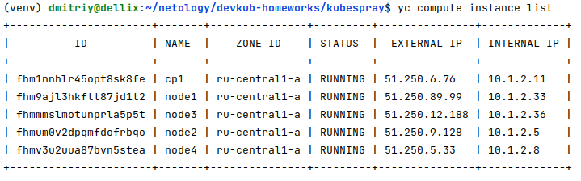
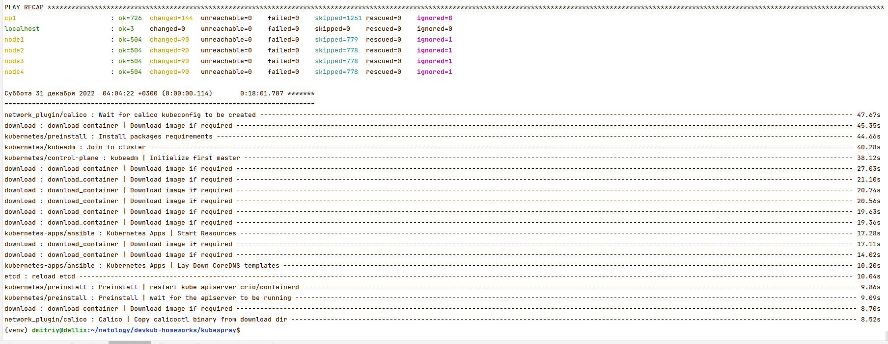
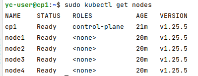
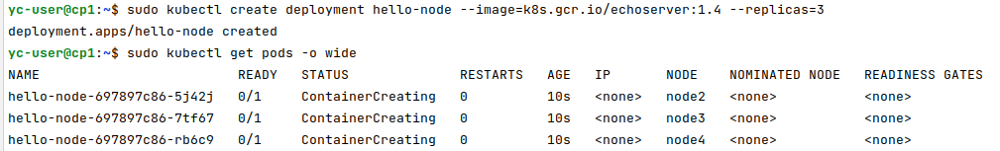
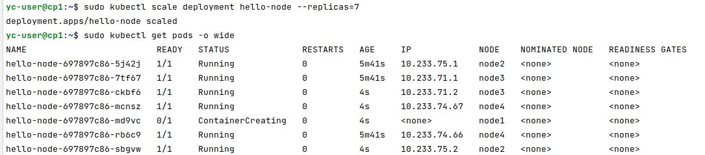

# Домашнее задание к занятию "12.4 Развертывание кластера на собственных серверах, лекция 2"
Новые проекты пошли стабильным потоком. Каждый проект требует себе несколько кластеров: под тесты и продуктив. Делать все руками — не вариант, поэтому стоит автоматизировать подготовку новых кластеров.

## Задание 1: Подготовить инвентарь kubespray
Новые тестовые кластеры требуют типичных простых настроек. Нужно подготовить инвентарь и проверить его работу. Требования к инвентарю:
* подготовка работы кластера из 5 нод: 1 мастер и 4 рабочие ноды;
* в качестве CRI — containerd;
* запуск etcd производить на мастере.

## Задание 2 (*): подготовить и проверить инвентарь для кластера в AWS
Часть новых проектов хотят запускать на мощностях AWS. Требования похожи:
* разворачивать 5 нод: 1 мастер и 4 рабочие ноды;
* работать должны на минимально допустимых EC2 — t3.small.

# Ответ:

#### Подготовил виртуалки в YandeCloud:



#### Проверил, в качестве CRI по-умолчанию, используется containerd, конфиг [kubespray](kubespray/inventory/netology-cluster/group_vars/k8s_cluster/k8s-cluster.yml) менять не потребовалось.

#### Подготовил [inventory.ini](kubespray/inventory/netology-cluster/inventory.ini)


```shell
dmitriy@dellix:~/netology/devkub-homeworks/kubespray$ yc compute instance list | tail -n +4 | awk -v FS="|" '{print $3" ansible_host="$6"ip="$7" ansible_user=yc-user"}' | sed 's/= /=/g'
 cp1    ansible_host=51.250.6.76   ip=10.1.2.11    ansible_user=yc-user
 node1  ansible_host=51.250.89.99  ip=10.1.2.33    ansible_user=yc-user
 node3  ansible_host=51.250.12.188 ip=10.1.2.36    ansible_user=yc-user
 node2  ansible_host=51.250.9.128  ip=10.1.2.5     ansible_user=yc-user
 node4  ansible_host=51.250.5.33   ip=10.1.2.8     ansible_user=yc-user
```

#### Деплой кластера запустил командой:

```shell
ansible-playbook -i inventory/netology-cluster/inventory.ini cluster.yml -b -v
```




```shell
PLAY RECAP *********************************************************************************************************************************************************************************************************************
cp1                        : ok=726  changed=144  unreachable=0    failed=0    skipped=1261 rescued=0    ignored=8   
localhost                  : ok=3    changed=0    unreachable=0    failed=0    skipped=0    rescued=0    ignored=0   
node1                      : ok=504  changed=90   unreachable=0    failed=0    skipped=779  rescued=0    ignored=1   
node2                      : ok=504  changed=90   unreachable=0    failed=0    skipped=778  rescued=0    ignored=1   
node3                      : ok=504  changed=90   unreachable=0    failed=0    skipped=778  rescued=0    ignored=1   
node4                      : ok=504  changed=90   unreachable=0    failed=0    skipped=778  rescued=0    ignored=1   

Суббота 31 декабря 2022  04:04:22 +0300 (0:00:00.114)       0:18:01.707 ******* 
=============================================================================== 
network_plugin/calico : Wait for calico kubeconfig to be created ------------------------------------------------------------------------------------------------------------------------------------------------------- 47.67s
download : download_container | Download image if required ------------------------------------------------------------------------------------------------------------------------------------------------------------- 45.35s
kubernetes/preinstall : Install packages requirements ------------------------------------------------------------------------------------------------------------------------------------------------------------------ 44.66s
kubernetes/kubeadm : Join to cluster ----------------------------------------------------------------------------------------------------------------------------------------------------------------------------------- 40.28s
kubernetes/control-plane : kubeadm | Initialize first master ----------------------------------------------------------------------------------------------------------------------------------------------------------- 38.12s
download : download_container | Download image if required ------------------------------------------------------------------------------------------------------------------------------------------------------------- 27.03s
download : download_container | Download image if required ------------------------------------------------------------------------------------------------------------------------------------------------------------- 21.10s
download : download_container | Download image if required ------------------------------------------------------------------------------------------------------------------------------------------------------------- 20.74s
download : download_container | Download image if required ------------------------------------------------------------------------------------------------------------------------------------------------------------- 20.56s
download : download_container | Download image if required ------------------------------------------------------------------------------------------------------------------------------------------------------------- 19.63s
download : download_container | Download image if required ------------------------------------------------------------------------------------------------------------------------------------------------------------- 19.36s
kubernetes-apps/ansible : Kubernetes Apps | Start Resources ------------------------------------------------------------------------------------------------------------------------------------------------------------ 17.28s
download : download_container | Download image if required ------------------------------------------------------------------------------------------------------------------------------------------------------------- 17.11s
download : download_container | Download image if required ------------------------------------------------------------------------------------------------------------------------------------------------------------- 14.02s
kubernetes-apps/ansible : Kubernetes Apps | Lay Down CoreDNS templates ------------------------------------------------------------------------------------------------------------------------------------------------- 10.20s
etcd : reload etcd ----------------------------------------------------------------------------------------------------------------------------------------------------------------------------------------------------- 10.04s
kubernetes/preinstall : Preinstall | restart kube-apiserver crio/containerd --------------------------------------------------------------------------------------------------------------------------------------------- 9.86s
kubernetes/preinstall : Preinstall | wait for the apiserver to be running ----------------------------------------------------------------------------------------------------------------------------------------------- 9.09s
download : download_container | Download image if required -------------------------------------------------------------------------------------------------------------------------------------------------------------- 8.70s
network_plugin/calico : Calico | Copy calicoctl binary from download dir ------------------------------------------------------------------------------------------------------------------------------------------------ 8.52s
```

#### Кластер Kubernetes запустился и работает:




#### Запустил деплоймент для проверки:

```shell
sudo kubectl create deployment hello-node --image=k8s.gcr.io/echoserver:1.4 --replicas=4
```



#### Проверил масштабирование:



---

### Как оформить ДЗ?

Выполненное домашнее задание пришлите ссылкой на .md-файл в вашем репозитории.

---
