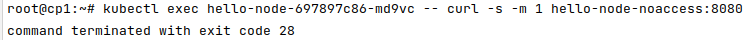

# Домашнее задание к занятию "12.5 Сетевые решения CNI"
После работы с Flannel появилась необходимость обеспечить безопасность для приложения. Для этого лучше всего подойдет Calico.
## Задание 1: установить в кластер CNI плагин Calico
Для проверки других сетевых решений стоит поставить отличный от Flannel плагин — например, Calico. Требования: 
* установка производится через ansible/kubespray;
* после применения следует настроить политику доступа к hello-world извне. Инструкции [kubernetes.io](https://kubernetes.io/docs/concepts/services-networking/network-policies/), [Calico](https://docs.projectcalico.org/about/about-network-policy)

## Задание 2: изучить, что запущено по умолчанию
Самый простой способ — проверить командой calicoctl get <type>. Для проверки стоит получить список нод, ipPool и profile.
Требования: 
* установить утилиту calicoctl;
* получить 3 вышеописанных типа в консоли.


# Ответ:

## Задание 1.

#### Поднял кластер с помощью [kubespray](kubespray/inventory/netology-cluster/group_vars/k8s_cluster/k8s-cluster.yml):


#### Развернул два пода hello-node и hello-node-noaccess:

```shell
kubectl create deployment hello-node --image=k8s.gcr.io/echoserver:1.4 --replicas=2
kubectl create deployment hello-node-noaccess --image=k8s.gcr.io/echoserver:1.4 --replicas=2
```


#### Создал сервис:


#### Проверил доступность этих сервисов, они доступны:


#### Создал политику разрешающую входящие соединения с hello-node-noacc на hello-node:

```shell
cat <<EOF | kubectl apply -f -
apiVersion: networking.k8s.io/v1
kind: NetworkPolicy
metadata:
  name: hello-node-noaccess
  namespace: default
spec:
  podSelector:
    matchLabels:
      app: hello-node-noaccess
  policyTypes:
    - Ingress
EOF
```


```shell
cat <<EOF | kubectl apply -f -
apiVersion: networking.k8s.io/v1
kind: NetworkPolicy
metadata:
  name: hello-node
  namespace: default
spec:
  podSelector:
    matchLabels:
      app: hello-node
  policyTypes:
    - Ingress
  ingress:
    - from:
      - podSelector:
          matchLabels:
            app: hello-node-noaccess
EOF
```
#### Создал дефолтное запрещающее правило:

```shell
cat <<EOF | kubectl apply -f -
apiVersion: networking.k8s.io/v1
kind: NetworkPolicy
metadata:
  name: default-deny-ingress
spec:
  podSelector: {}
  policyTypes:
    - Ingress
EOF
```
#### Проверил, с hello-node-noaccess на hello-node доступ присутствует:

```shell
kubectl exec hello-node-noaccess-9b4f9d8c4-t65m6 -- curl -s -m 1 hello-node:8080
```


#### Проверил доступ с hello-node на hello-node-noaccess - отсутствует:

```shell
kubectl exec hello-node-697897c86-md9vc -- curl -s -m 1 hello-node-noaccess:8080
```



## Задание 2.

### Calico был включен в конфиге кластера, соответственно утилита уже была установлена calicoctl:


#### Вывод команды calicoctl get ipPool:


#### Вывод команды calicoctl get nodes:


#### Вывод команды calicoctl get profile:


### Как оформить ДЗ?

Выполненное домашнее задание пришлите ссылкой на .md-файл в вашем репозитории.
