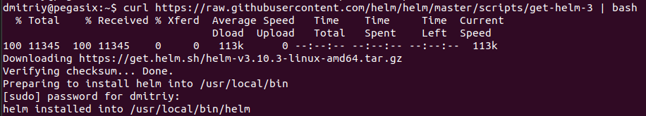
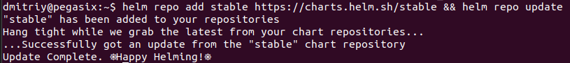
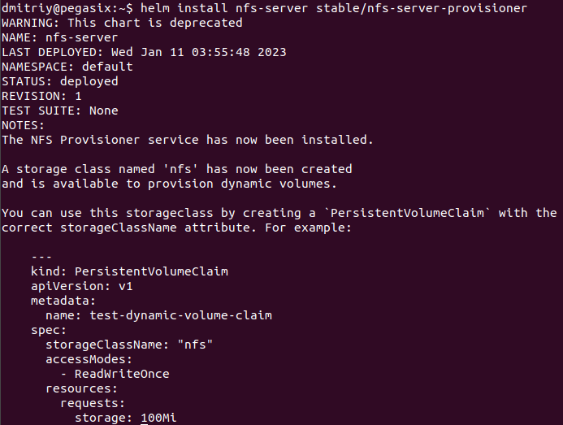
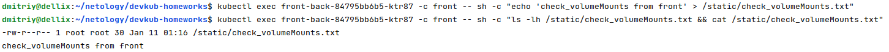
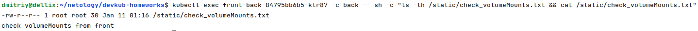
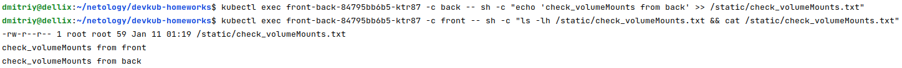
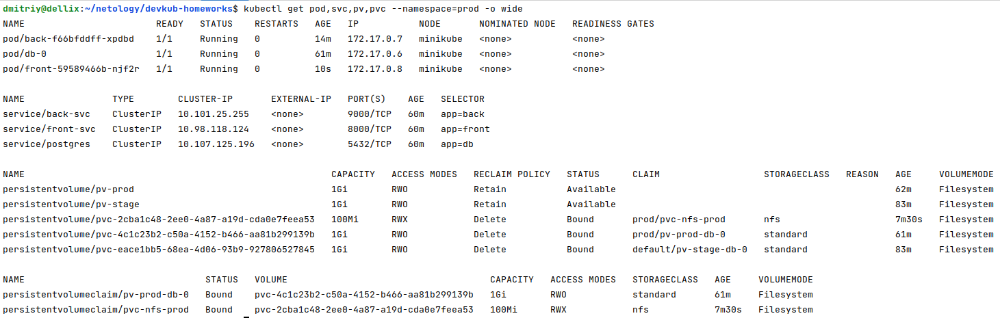
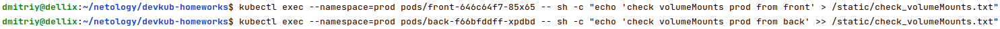
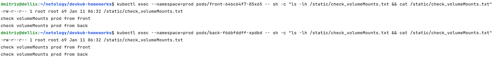

# Домашнее задание к занятию "13.2 разделы и монтирование"
Приложение запущено и работает, но время от времени появляется необходимость передавать между бекендами данные. А сам бекенд генерирует статику для фронта. Нужно оптимизировать это.
Для настройки NFS сервера можно воспользоваться следующей инструкцией (производить под пользователем на сервере, у которого есть доступ до kubectl):
* установить helm: curl https://raw.githubusercontent.com/helm/helm/master/scripts/get-helm-3 | bash
* добавить репозиторий чартов: helm repo add stable https://charts.helm.sh/stable && helm repo update
* установить nfs-server через helm: helm install nfs-server stable/nfs-server-provisioner

В конце установки будет выдан пример создания PVC для этого сервера.

## Задание 1: подключить для тестового конфига общую папку
В stage окружении часто возникает необходимость отдавать статику бекенда сразу фронтом. Проще всего сделать это через общую папку. Требования:
* в поде подключена общая папка между контейнерами (например, /static);
* после записи чего-либо в контейнере с беком файлы можно получить из контейнера с фронтом.

## Задание 2: подключить общую папку для прода
Поработав на stage, доработки нужно отправить на прод. В продуктиве у нас контейнеры крутятся в разных подах, поэтому потребуется PV и связь через PVC. Сам PV должен быть связан с NFS сервером. Требования:
* все бекенды подключаются к одному PV в режиме ReadWriteMany;
* фронтенды тоже подключаются к этому же PV с таким же режимом;
* файлы, созданные бекендом, должны быть доступны фронту.


# Ответ:

## Подготовка, установка NFS сервера:







```shell
---
kind: PersistentVolumeClaim
apiVersion: v1
metadata:
  name: test-dynamic-volume-claim
spec:
  storageClassName: "nfs"
  accessModes:
    - ReadWriteOnce
  resources:
    requests:
      storage: 100Mi
```

## Задание 1.

### Подготовил манифест [front-back-app.yml](13-kubernetes-config-02/stage/front-back-app.yml) для запуска тестового окружения, запустил:

[stage](13-kubernetes-config-02/stage/)

```shell
kubectl apply -f 13-kubernetes-config-02/stage/front-back-app.yml 
```

```shell
dmitriy@dellix:~/netology/devkub-homeworks$ kubectl get pod,svc,pv,pvc -o wide
NAME                                      READY   STATUS    RESTARTS   AGE     IP           NODE       NOMINATED NODE   READINESS GATES
pod/db-0                                  1/1     Running   0          5h31m   172.17.0.4   minikube   <none>           <none>
pod/front-back-84795bb6b5-ktr87           2/2     Running   0          5h30m   172.17.0.5   minikube   <none>           <none>
pod/nfs-server-nfs-server-provisioner-0   1/1     Running   0          5h44m   172.17.0.3   minikube   <none>           <none>

NAME                                        TYPE        CLUSTER-IP       EXTERNAL-IP   PORT(S)                                                                                                     AGE     SELECTOR
service/kubernetes                          ClusterIP   10.96.0.1        <none>        443/TCP                                                                                                     6h7m    <none>
service/nfs-server-nfs-server-provisioner   ClusterIP   10.110.238.203   <none>        2049/TCP,2049/UDP,32803/TCP,32803/UDP,20048/TCP,20048/UDP,875/TCP,875/UDP,111/TCP,111/UDP,662/TCP,662/UDP   5h44m   app=nfs-server-provisioner,release=nfs-server
service/postgres                            ClusterIP   10.97.117.164    <none>        5432/TCP                                                                                                    5h31m   app=db

NAME                                                        CAPACITY   ACCESS MODES   RECLAIM POLICY   STATUS      CLAIM                   STORAGECLASS   REASON   AGE     VOLUMEMODE
persistentvolume/pv-prod                                    1Gi        RWO            Retain           Available                                                   5h10m   Filesystem
persistentvolume/pv-stage                                   1Gi        RWO            Retain           Available                                                   5h31m   Filesystem
persistentvolume/pvc-2cba1c48-2ee0-4a87-a19d-cda0e7feea53   100Mi      RWX            Delete           Bound       prod/pvc-nfs-prod       nfs                     4h15m   Filesystem
persistentvolume/pvc-4c1c23b2-c50a-4152-b466-aa81b299139b   1Gi        RWO            Delete           Bound       prod/pv-prod-db-0       standard                5h9m    Filesystem
persistentvolume/pvc-eace1bb5-68ea-4d06-93b9-927806527845   1Gi        RWO            Delete           Bound       default/pv-stage-db-0   standard                5h31m   Filesystem

NAME                                  STATUS   VOLUME                                     CAPACITY   ACCESS MODES   STORAGECLASS   AGE     VOLUMEMODE
persistentvolumeclaim/pv-stage-db-0   Bound    pvc-eace1bb5-68ea-4d06-93b9-927806527845   1Gi        RWO            standard       5h31m   Filesystem
```

### Создал файл в общей папке, в контейнере front:

```shell
dmitriy@dellix:~/netology/devkub-homeworks$ kubectl exec front-back-84795bb6b5-ktr87 -c front -- sh -c "echo 'check_volumeMounts from front' > /static/check_volumeMounts.txt"
dmitriy@dellix:~/netology/devkub-homeworks$ kubectl exec front-back-84795bb6b5-ktr87 -c front -- sh -c "ls -lh /static/check_volumeMounts.txt && cat /static/check_volumeMounts.txt"
-rw-r--r-- 1 root root 30 Jan 11 01:16 /static/check_volumeMounts.txt
check_volumeMounts from front
```



### Проверил файл из контейнера back, файл существует:

```shell
dmitriy@dellix:~/netology/devkub-homeworks$ kubectl exec front-back-84795bb6b5-ktr87 -c back -- sh -c "ls -lh /static/check_volumeMounts.txt && cat /static/check_volumeMounts.txt"
-rw-r--r-- 1 root root 30 Jan 11 01:16 /static/check_volumeMounts.txt
check_volumeMounts from front
```



### Добавил в файл строчку из контейнера back, проверил с front, строчка появилась:

```shell
dmitriy@dellix:~/netology/devkub-homeworks$ kubectl exec front-back-84795bb6b5-ktr87 -c back -- sh -c "echo 'check_volumeMounts from back' >> /static/check_volumeMounts.txt"
dmitriy@dellix:~/netology/devkub-homeworks$ kubectl exec front-back-84795bb6b5-ktr87 -c front -- sh -c "ls -lh /static/check_volumeMounts.txt && cat /static/check_volumeMounts.txt"
-rw-r--r-- 1 root root 59 Jan 11 01:19 /static/check_volumeMounts.txt
check_volumeMounts from front
check_volumeMounts from back
```


### Подготовил манифесты - [pvc-nfs-prod.yml](13-kubernetes-config-02/prod/pvc-nfs-prod.yml), [front-app.yml](13-kubernetes-config-02/prod/front-app.yml), [back-app.yml](13-kubernetes-config-02/prod/back-app.yml) и запустил prod окружение:

[prod](13-kubernetes-config-02/prod/)

```shell
kubectl apply -f 13-kubernetes-config-02/prod/db-pv-prod.yml --namespace=prod
kubectl apply -f 13-kubernetes-config-02/prod/db-statefulset.yml --namespace=prod
kubectl apply -f 13-kubernetes-config-02/prod/db-svc.yml --namespace=prod

kubectl apply -f 13-kubernetes-config-02/prod/pvc-nfs-prod.yml --namespace=prod
kubectl apply -f 13-kubernetes-config-02/prod/front-app.yml --namespace=prod
kubectl apply -f 13-kubernetes-config-02/prod/back-app.yml --namespace=prod
```

### Prod запущен:

```shell
dmitriy@dellix:~/netology/devkub-homeworks$ kubectl get pod,svc,pv,pvc --namespace=prod -o wide
NAME                        READY   STATUS    RESTARTS   AGE   IP           NODE       NOMINATED NODE   READINESS GATES
pod/back-f66bfddff-xpdbd    1/1     Running   0          14m   172.17.0.7   minikube   <none>           <none>
pod/db-0                    1/1     Running   0          61m   172.17.0.6   minikube   <none>           <none>
pod/front-59589466b-njf2r   1/1     Running   0          10s   172.17.0.8   minikube   <none>           <none>

NAME                TYPE        CLUSTER-IP       EXTERNAL-IP   PORT(S)    AGE   SELECTOR
service/back-svc    ClusterIP   10.101.25.255    <none>        9000/TCP   60m   app=back
service/front-svc   ClusterIP   10.98.118.124    <none>        8000/TCP   60m   app=front
service/postgres    ClusterIP   10.107.125.196   <none>        5432/TCP   60m   app=db

NAME                                                        CAPACITY   ACCESS MODES   RECLAIM POLICY   STATUS      CLAIM                   STORAGECLASS   REASON   AGE     VOLUMEMODE
persistentvolume/pv-prod                                    1Gi        RWO            Retain           Available                                                   62m     Filesystem
persistentvolume/pv-stage                                   1Gi        RWO            Retain           Available                                                   83m     Filesystem
persistentvolume/pvc-2cba1c48-2ee0-4a87-a19d-cda0e7feea53   100Mi      RWX            Delete           Bound       prod/pvc-nfs-prod       nfs                     7m30s   Filesystem
persistentvolume/pvc-4c1c23b2-c50a-4152-b466-aa81b299139b   1Gi        RWO            Delete           Bound       prod/pv-prod-db-0       standard                61m     Filesystem
persistentvolume/pvc-eace1bb5-68ea-4d06-93b9-927806527845   1Gi        RWO            Delete           Bound       default/pv-stage-db-0   standard                83m     Filesystem

NAME                                 STATUS   VOLUME                                     CAPACITY   ACCESS MODES   STORAGECLASS   AGE     VOLUMEMODE
persistentvolumeclaim/pv-prod-db-0   Bound    pvc-4c1c23b2-c50a-4152-b466-aa81b299139b   1Gi        RWO            standard       61m     Filesystem
persistentvolumeclaim/pvc-nfs-prod   Bound    pvc-2cba1c48-2ee0-4a87-a19d-cda0e7feea53   100Mi      RWX            nfs            7m30s   Filesystem
```


### В файл в общей папке записал строчки с front и с back, перекрестно проверил, файл доступен с обоих контейнеров: 

```shell
dmitriy@dellix:~/netology/devkub-homeworks$ kubectl exec --namespace=prod pods/front-646c64f7-85x65 -- sh -c "echo 'check volumeMounts prod from front' > /static/check_volumeMounts.txt"
dmitriy@dellix:~/netology/devkub-homeworks$ kubectl exec --namespace=prod pods/back-f66bfddff-xpdbd -- sh -c "echo 'check volumeMounts prod from back' >> /static/check_volumeMounts.txt"
dmitriy@dellix:~/netology/devkub-homeworks$ kubectl exec --namespace=prod pods/front-646c64f7-85x65 -- sh -c "ls -lh /static/check_volumeMounts.txt && cat /static/check_volumeMounts.txt"
-rw-r--r-- 1 root root 69 Jan 11 06:32 /static/check_volumeMounts.txt
check volumeMounts prod from front
check volumeMounts prod from back
dmitriy@dellix:~/netology/devkub-homeworks$ kubectl exec --namespace=prod pods/back-f66bfddff-xpdbd -- sh -c "ls -lh /static/check_volumeMounts.txt && cat /static/check_volumeMounts.txt"
-rw-r--r-- 1 root root 69 Jan 11 06:32 /static/check_volumeMounts.txt
check volumeMounts prod from front
check volumeMounts prod from back
```



---

### Как оформить ДЗ?

Выполненное домашнее задание пришлите ссылкой на .md-файл в вашем репозитории.

---
