# Домашнее задание к занятию "13.3 работа с kubectl"
## Задание 1: проверить работоспособность каждого компонента
Для проверки работы можно использовать 2 способа: port-forward и exec. Используя оба способа, проверьте каждый компонент:
* сделайте запросы к бекенду;
* сделайте запросы к фронту;
* подключитесь к базе данных.

## Задание 2: ручное масштабирование

При работе с приложением иногда может потребоваться вручную добавить пару копий. Используя команду kubectl scale, попробуйте увеличить количество бекенда и фронта до 3. Проверьте, на каких нодах оказались копии после каждого действия (kubectl describe, kubectl get pods -o wide). После уменьшите количество копий до 1.


# Ответ:

## Задание 1.

### Подготовил kubernetes кластер:

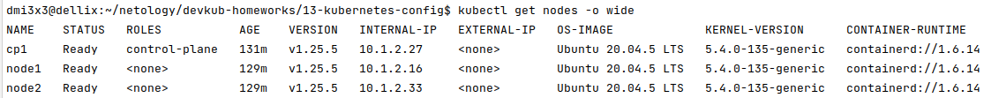

### Создал namespace stage:
```shell
kubectl create namespace stage
```

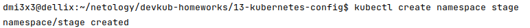
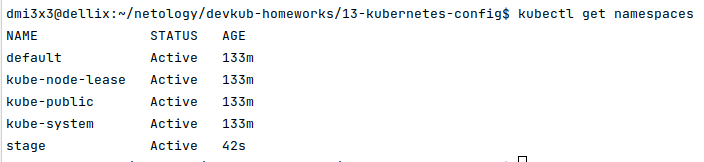

### Создал конфиги [db-pv-stage.yml](13-kubernetes-config.stage/db-pv-stage.yml), [db-statefulset.yml](13-kubernetes-config.stage/db-statefulset.yml), [db-svc.yml](13-kubernetes-config.stage/db-svc.yml) и запустил БД:
```shell
kubectl apply -f stage/db-pv-stage.yml --namespace=stage
kubectl apply -f stage/db-statefulset.yml --namespace=stage
kubectl apply -f stage/db-svc.yml --namespace=stage
```
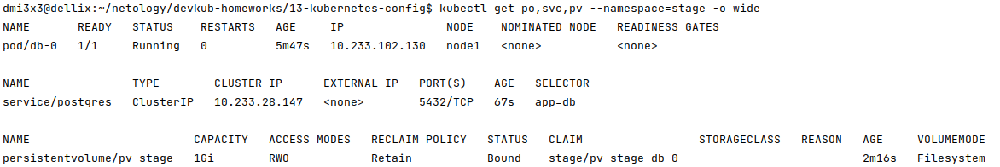

### Создал конфиг [front-app.yml](13-kubernetes-config.stage/front-app.yml) и запустил frontend и backend:
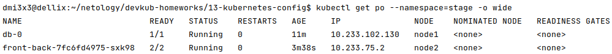

### Frontend работает:
```shell
kubectl exec front-back-7fc6fd4975-sxk98 -c front --namespace=stage -- curl http://localhost:80
```


### Backend работает:
```shell
kubectl exec front-back-7fc6fd4975-sxk98 -c back --namespace=stage -- curl http://back-svc.prod.svc.cluster.local:9000/api/news/
```
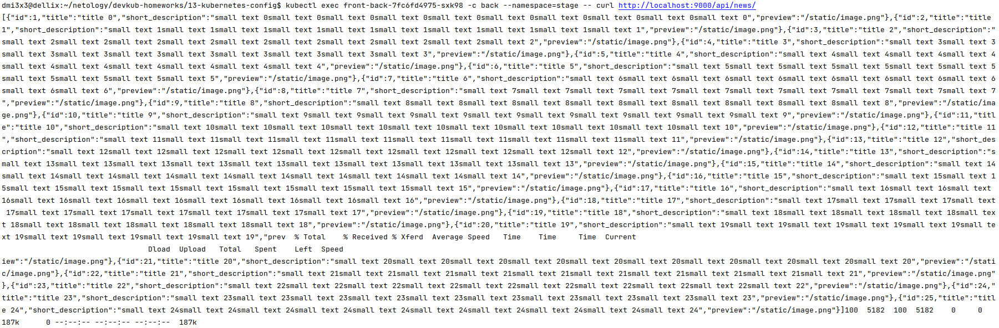
### По логам виден запрос на /api/news/
```shell
dmi3x3@dellix:~/netology/devkub-homeworks/13-kubernetes-config$ kubectl logs front-back-7fc6fd4975-sxk98 -c back --namespace=stage
INFO:     Uvicorn running on http://0.0.0.0:9000 (Press CTRL+C to quit)
INFO:     Started reloader process [7] using statreload
INFO:     Started server process [9]
INFO:     Waiting for application startup.
INFO:     Application startup complete.
INFO:     127.0.0.1:52840 - "GET /api/news/ HTTP/1.1" 200 OK
```

## Задание 2

### Создал namespace prod
```shell
kubectl create namespace prod
```

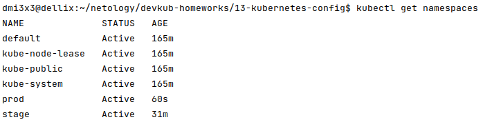

### Создал конфиги для prod:

| Контроллер   | Приложение | Конфиг для приложения                                           | Конфиг для сервиса                                       | Конфиг для pv                                              |
|--------------|------------|--------------------------------------------------------------------|----------------------------------------------------------|------------------------------------------------------------|
| satatefulset | db         | [db-statefulset.yml](13-kubernetes-config/prod/db-statefulset.yml) | [db-svc.yml](13-kubernetes-config/prod/db-svc.yml)       | [db-pv-prod.yml](13-kubernetes-config/prod/db-pv-prod.yml) |
| deployment   | frontend   | [front-app.yml](13-kubernetes-config/prod/front-app.yml)           | [front-svc.yml](13-kubernetes-config/prod/front-svc.yml) |                                                            |
| deployment   | backend    | [back-app.yml](13-kubernetes-config/prod/back-app.yml)             | [back-svc.yml](13-kubernetes-config/prod/baсk-svc.yml)   |                                                            |

### Применил конфиги, стек поднят:
```shell
find prod/ -exec kubectl apply --namespace=prod -f {} \;
```

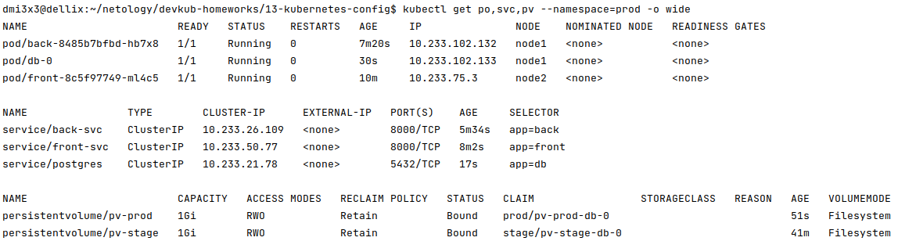

### Frontend работает:

```shell
curl http://front-svc.prod.svc.cluster.local:8000
```
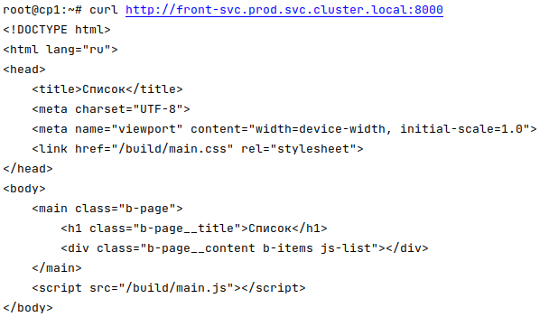

### Backend работает:

```shell
curl http://back-svc.prod.svc.cluster.local:9000/api/news/
```

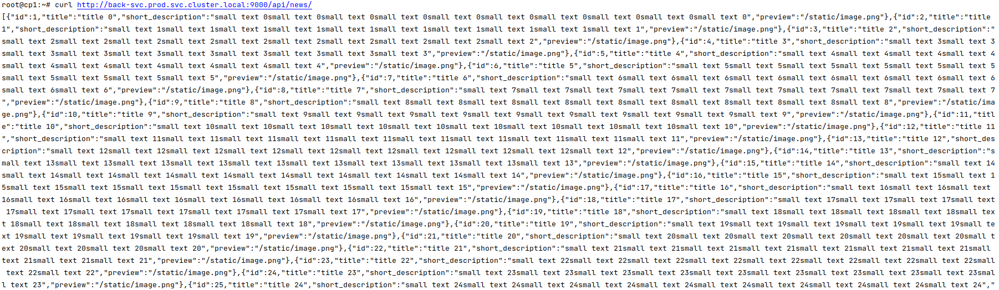

### Список запущенных объектов по типам:

```shell
kubectl get po,deploy,sts,svc --namespace=prod -o wide
```

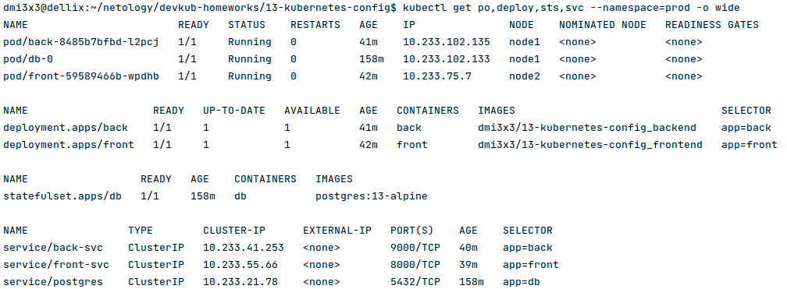


## Задание 3.

### Для задания выбрал сервис [numbersapi.com](http://numbersapi.com) "API интересных фактов о числах"

### Создал конфиги для [сервиса](13-kubernetes-config/endpoints/service-numbersapi.yml) и [эндпоинта](13-kubernetes-config/endpoints/endpoint-numbersapi.yml)

### Применил их, появился сервис nubersapi:

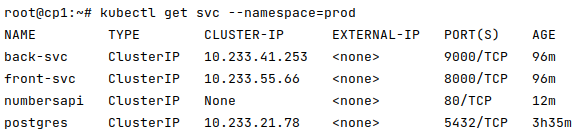

### И эндпоинт nubersapi:

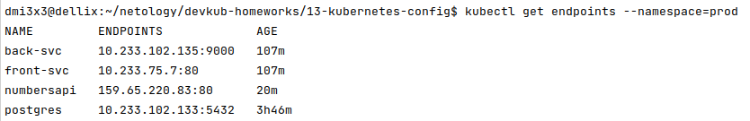

### Выполнил несколько запросов, работает:
```shell
root@cp1:~# curl http://numbersapi.prod.svc.cluster.local/42
42 is the number of US gallons in a barrel of oil.
root@cp1:~# curl http://numbersapi.prod.svc.cluster.local/58
58 is the number of usable cells on a Hexxagon game board.
root@cp1:~# curl http://numbersapi.prod.svc.cluster.local/77
77 is the atomic number of iridium.
```
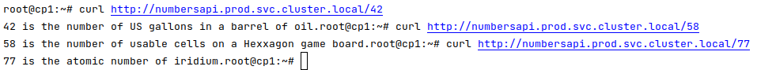

### Как оформить ДЗ?

Выполненное домашнее задание пришлите ссылкой на .md-файл в вашем репозитории.

---
