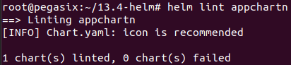
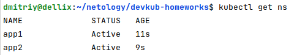
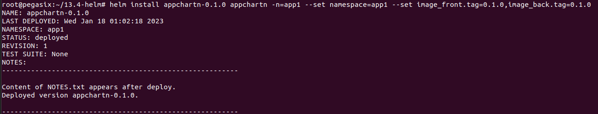
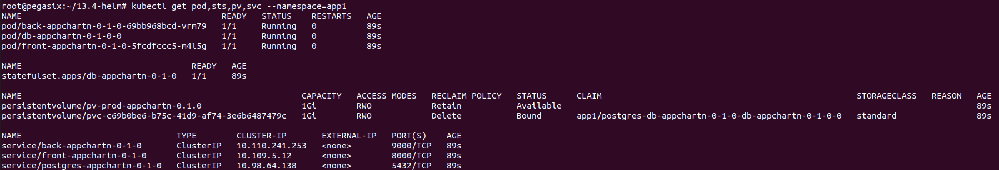
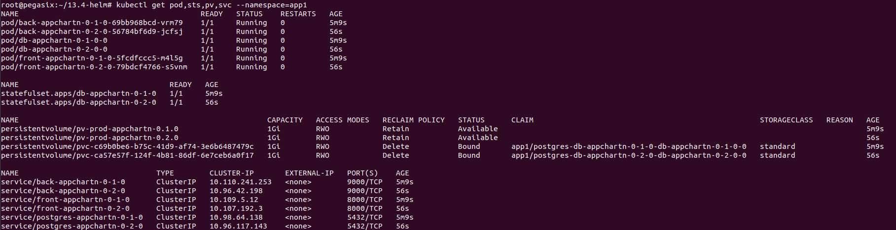
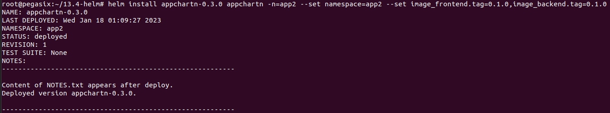
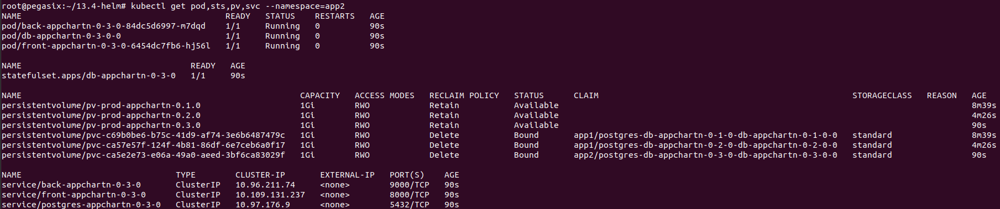
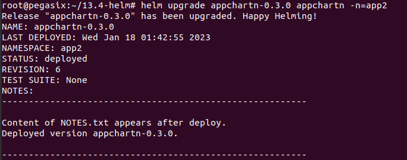
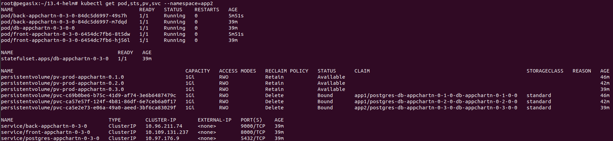

# Домашнее задание к занятию "13.4 инструменты для упрощения написания конфигурационных файлов. Helm и Jsonnet"
В работе часто приходится применять системы автоматической генерации конфигураций. Для изучения нюансов использования разных инструментов нужно попробовать упаковать приложение каждым из них.

## Задание 1: подготовить helm чарт для приложения
Необходимо упаковать приложение в чарт для деплоя в разные окружения. Требования:
* каждый компонент приложения деплоится отдельным deployment’ом/statefulset’ом;
* в переменных чарта измените образ приложения для изменения версии.

## Задание 2: запустить 2 версии в разных неймспейсах
Подготовив чарт, необходимо его проверить. Попробуйте запустить несколько копий приложения:
* одну версию в namespace=app1;
* вторую версию в том же неймспейсе;
* третью версию в namespace=app2.

## Задание 3 (*): повторить упаковку на jsonnet
Для изучения другого инструмента стоит попробовать повторить опыт упаковки из задания 1, только теперь с помощью инструмента jsonnet.

---

# Ответ:

## Задание 1.

### Подготовил helm чарт [appchartn](13.4-helm/appchartn) для приложения:

#### Создал чарт: 

```shell
helm create appchartn
```
#### Для создания чарта использовал [templates](13.4-helm/appchartn/templates), произвел простейшую проверку:

```shell
helm template app
helm lint app
```



### Создал NS:

```shell
kubectl create namespace app1
kubectl create namespace app2
```




### Выполнил деплой чарта c версией 0.1.0 в namespace=app1:

```shell
helm install appchartn-0.1.0 appchartn -n=app1 --set namespace=app1 --set image_front.tag=0.1.0,image_back.tag=0.1.0
```





### Выполнил деплой чарта c версией 0.2.0 в namespace=app1:
#### Для обеспечения уникальности имен объектов чарта в шаблонах используется переменная {{ Release.Name }} .
```shell
helm install appchartn-0.2.0 appchartn -n=app1 --set namespace=app1 --set image_frontend.tag=0.1.0,image_backend.tag=0.1.0
```




### Выполнил деплой чарта c версией 0.3.0 в namespace=app2:

```shell
helm install appchartn-0.3.0 appchartn -n=app2 --set namespace=app2 --set image_frontend.tag=0.1.0,image_backend.tag=0.1.0
```





### Увеличил количество реплик фронта и бэка:

<details>
<summary>cat appchartn/values.yaml</summary>

```shell
root@pegasix:~/13.4-helm# cat appchartn/values.yaml 
front:
  image: 'dmi3x3/13-kubernetes-config_frontend'
  tag: 'latest'
  replicaCount: 2
back:
  image: 'dmi3x3/13-kubernetes-config_backend'
  tag: 'latest'
  replicaCount: 2

namespace: 'default'
```
</details>

```shell
helm upgrade appchartn-0.3.0 appchartn -n=app2
```





### При выполнении ДЗ часто использовал команды:

```shell
`helm get manifest appchartn-0.1.0 -n=app1`
```

```shell
`helm upgrade appchartn-0.3.0 appchartn -n=app2`
```

```shell
kubectl get pod,sts,pv,svc --namespace=app2
```

### Как оформить ДЗ?

Выполненное домашнее задание пришлите ссылкой на .md-файл в вашем репозитории.

---
