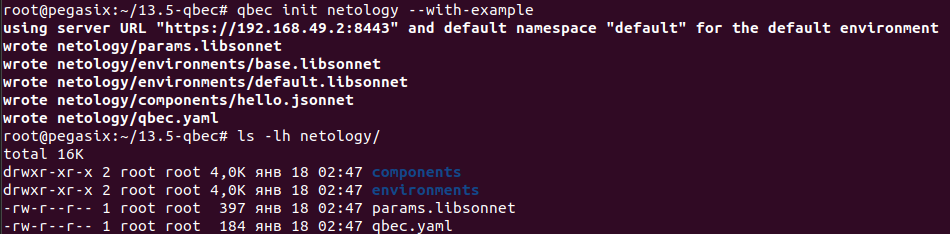
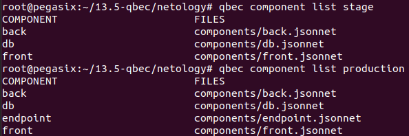
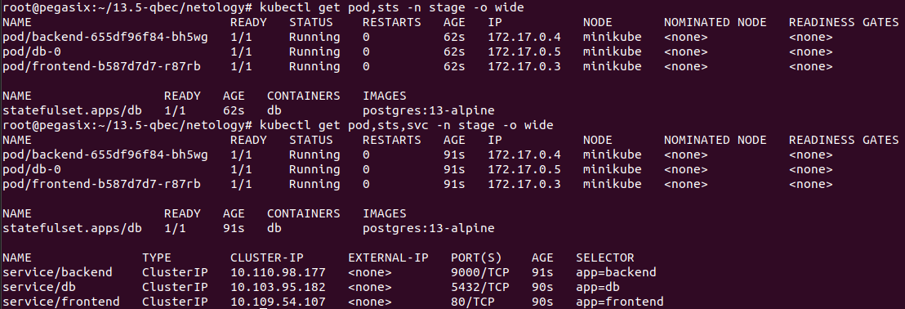
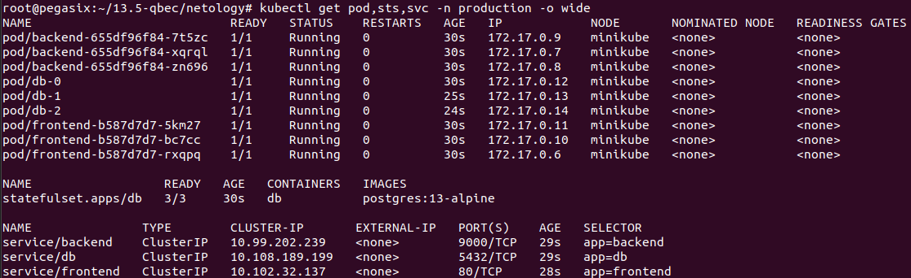

# Домашнее задание к занятию "13.5 поддержка нескольких окружений на примере Qbec"
Приложение обычно существует в нескольких окружениях. Для удобства работы следует использовать соответствующие инструменты, например, Qbec.

## Задание 1: подготовить приложение для работы через qbec
Приложение следует упаковать в qbec. Окружения должно быть 2: stage и production. 

Требования:
* stage окружение должно поднимать каждый компонент приложения в одном экземпляре;
* production окружение — каждый компонент в трёх экземплярах;
* для production окружения нужно добавить endpoint на внешний адрес.

# Ответ:

## Задание 1.

### Установил qbec, jsonnet, создал конфигурацию:

```shell
qbec init netology --with-example
```




### Привел конфигурацию [netology](13.5-qbec/netology) в соответствие с заданием, посмотрел список компонентов в окружении

qbec component list stage
qbec component list prod



### Проверил конфигурацию для stage и production:

```shell
root@pegasix:~/13.5-qbec/netology# qbec validate stage 
setting cluster to minikube
setting context to minikube
cluster metadata load took 13ms
3 components evaluated in 5ms
✔ deployments back -n stage (source back) is valid
✔ services front -n stage (source front) is valid
✔ services back -n stage (source back) is valid
✔ services db -n stage (source db) is valid
✔ statefulsets db -n stage (source db) is valid
✔ deployments front -n stage (source front) is valid
---
stats:
  valid: 6

root@pegasix:~/13.5-qbec/netology# qbec validate production 
setting cluster to minikube
setting context to minikube
cluster metadata load took 16ms
4 components evaluated in 6ms
✔ deployments back -n production (source back) is valid
✔ deployments front -n production (source front) is valid
✔ services front -n production (source front) is valid
✔ services back -n production (source back) is valid
✔ services db -n production (source db) is valid
✔ endpoints quiz -n production (source endpoint) is valid
✔ statefulsets db -n production (source db) is valid
---
stats:
  valid: 7
```

### Создал namespaces production и stage:

```shell
kubectl create ns production
kubectl create ns stage
```


```shell
root@pegasix:~/13.5-qbec/netology# kubectl get ns
NAME              STATUS   AGE
default           Active   7d10h
kube-node-lease   Active   7d10h
kube-public       Active   7d10h
kube-system       Active   7d10h
production        Active   51s
stage             Active   3h21m
```

### Произвел развертывание компонентов в окружение stage:

<details>
<summary>qbec apply stage --yes</summary>

```shell
root@pegasix:~/13.5-qbec/netology# qbec apply stage --yes
setting cluster to minikube
setting context to minikube
cluster metadata load took 17ms
3 components evaluated in 4ms

will synchronize 6 object(s)

3 components evaluated in 3ms
create deployments backend -n stage (source back)
create deployments frontend -n stage (source front)
create statefulsets db -n stage (source db)
create services backend -n stage (source back)
create services db -n stage (source db)
create services frontend -n stage (source front)
server objects load took 204ms
---
stats:
  created:
  - deployments backend -n stage (source back)
  - deployments frontend -n stage (source front)
  - statefulsets db -n stage (source db)
  - services backend -n stage (source back)
  - services db -n stage (source db)
  - services frontend -n stage (source front)

waiting for readiness of 3 objects
  - deployments backend -n stage   
  - deployments frontend -n stage  
  - statefulsets db -n stage

  0s    : deployments backend -n stage :: 0 of 1 updated replicas are available
✓ 0s    : statefulsets db -n stage :: 1 new pods updated (2 remaining)
  0s    : deployments frontend -n stage :: 0 of 1 updated replicas are available
✓ 1s    : deployments backend -n stage :: successfully rolled out (1 remaining)
✓ 1s    : deployments frontend -n stage :: successfully rolled out (0 remaining)

✓ 1s: rollout complete
command took 2.85s
```
</details>

### Проверил, что все компоненты для stage запущены:

<details>
<summary>kubectl get pod,sts -n stage -o wide</summary>

```shell
root@pegasix:~/13.5-qbec/netology# kubectl get pod,sts -n stage -o wide
NAME                           READY   STATUS    RESTARTS   AGE   IP           NODE       NOMINATED NODE   READINESS GATES
pod/backend-655df96f84-bh5wg   1/1     Running   0          62s   172.17.0.4   minikube   <none>           <none>
pod/db-0                       1/1     Running   0          62s   172.17.0.5   minikube   <none>           <none>
pod/frontend-b587d7d7-r87rb    1/1     Running   0          62s   172.17.0.3   minikube   <none>           <none>

NAME                  READY   AGE   CONTAINERS   IMAGES
statefulset.apps/db   1/1     62s   db           postgres:13-alpine
root@pegasix:~/13.5-qbec/netology# kubectl get pod,sts,svc -n stage -o wide
NAME                           READY   STATUS    RESTARTS   AGE   IP           NODE       NOMINATED NODE   READINESS GATES
pod/backend-655df96f84-bh5wg   1/1     Running   0          91s   172.17.0.4   minikube   <none>           <none>
pod/db-0                       1/1     Running   0          91s   172.17.0.5   minikube   <none>           <none>
pod/frontend-b587d7d7-r87rb    1/1     Running   0          91s   172.17.0.3   minikube   <none>           <none>

NAME                  READY   AGE   CONTAINERS   IMAGES
statefulset.apps/db   1/1     91s   db           postgres:13-alpine

NAME               TYPE        CLUSTER-IP      EXTERNAL-IP   PORT(S)    AGE   SELECTOR
service/backend    ClusterIP   10.110.98.177   <none>        9000/TCP   91s   app=backend
service/db         ClusterIP   10.103.95.182   <none>        5432/TCP   90s   app=db
service/frontend   ClusterIP   10.109.54.107   <none>        80/TCP     90s   app=frontend
```
</details>

### Произвел развертывание компонентов в окружение production:

<details>
<summary>qbec apply production --yes</summary>

```shell
root@pegasix:~/13.5-qbec/netology# qbec apply production --yes
setting cluster to minikube
setting context to minikube
cluster metadata load took 14ms
4 components evaluated in 8ms

will synchronize 7 object(s)

4 components evaluated in 5ms
create endpoints prodenp -n production (source endpoint)
create deployments backend -n production (source back)
create deployments frontend -n production (source front)
create statefulsets db -n production (source db)
create services backend -n production (source back)
create services db -n production (source db)
create services frontend -n production (source front)
server objects load took 603ms
---
stats:
  created:
  - endpoints prodenp -n production (source endpoint)
  - deployments backend -n production (source back)
  - deployments frontend -n production (source front)
  - statefulsets db -n production (source db)
  - services backend -n production (source back)
  - services db -n production (source db)
  - services frontend -n production (source front)

waiting for readiness of 3 objects
  - deployments backend -n production
  - deployments frontend -n production
  - statefulsets db -n production

  0s    : statefulsets db -n production :: 1 of 3 updated
  0s    : deployments frontend -n production :: 0 of 3 updated replicas are available
  0s    : deployments backend -n production :: 0 of 3 updated replicas are available
  1s    : deployments backend -n production :: 1 of 3 updated replicas are available
  2s    : deployments frontend -n production :: 1 of 3 updated replicas are available
  2s    : deployments backend -n production :: 2 of 3 updated replicas are available
✓ 2s    : deployments backend -n production :: successfully rolled out (2 remaining)
  3s    : deployments frontend -n production :: 2 of 3 updated replicas are available
✓ 3s    : deployments frontend -n production :: successfully rolled out (1 remaining)
  3s    : statefulsets db -n production :: 2 of 3 updated
✓ 5s    : statefulsets db -n production :: 3 new pods updated (0 remaining)

✓ 5s: rollout complete
command took 6.43s
```
</details>



### Проверил, что все компоненты для production запущены:

<details>
<summary>kubectl get pod,sts -n production -o wide</summary>

```shell
root@pegasix:~/13.5-qbec/netology# kubectl get pod,sts,svc -n production -o wide
NAME                           READY   STATUS    RESTARTS   AGE   IP            NODE       NOMINATED NODE   READINESS GATES
pod/backend-655df96f84-7t5zc   1/1     Running   0          30s   172.17.0.9    minikube   <none>           <none>
pod/backend-655df96f84-xqrql   1/1     Running   0          30s   172.17.0.7    minikube   <none>           <none>
pod/backend-655df96f84-zn696   1/1     Running   0          30s   172.17.0.8    minikube   <none>           <none>
pod/db-0                       1/1     Running   0          30s   172.17.0.12   minikube   <none>           <none>
pod/db-1                       1/1     Running   0          25s   172.17.0.13   minikube   <none>           <none>
pod/db-2                       1/1     Running   0          24s   172.17.0.14   minikube   <none>           <none>
pod/frontend-b587d7d7-5km27    1/1     Running   0          30s   172.17.0.11   minikube   <none>           <none>
pod/frontend-b587d7d7-bc7cc    1/1     Running   0          30s   172.17.0.10   minikube   <none>           <none>
pod/frontend-b587d7d7-rxqpq    1/1     Running   0          30s   172.17.0.6    minikube   <none>           <none>

NAME                  READY   AGE   CONTAINERS   IMAGES
statefulset.apps/db   3/3     30s   db           postgres:13-alpine

NAME               TYPE        CLUSTER-IP       EXTERNAL-IP   PORT(S)    AGE   SELECTOR
service/backend    ClusterIP   10.99.202.239    <none>        9000/TCP   29s   app=backend
service/db         ClusterIP   10.108.189.199   <none>        5432/TCP   29s   app=db
service/frontend   ClusterIP   10.102.32.137    <none>        80/TCP     28s   app=frontend
```
</details>



### Для удаления развернутых окружений production и stage, выполнить:

```shell
qbec delete production --yes
qbec delete stage --yes
```

---

### Как оформить ДЗ?

Выполненное домашнее задание пришлите ссылкой на .md-файл в вашем репозитории.

---
